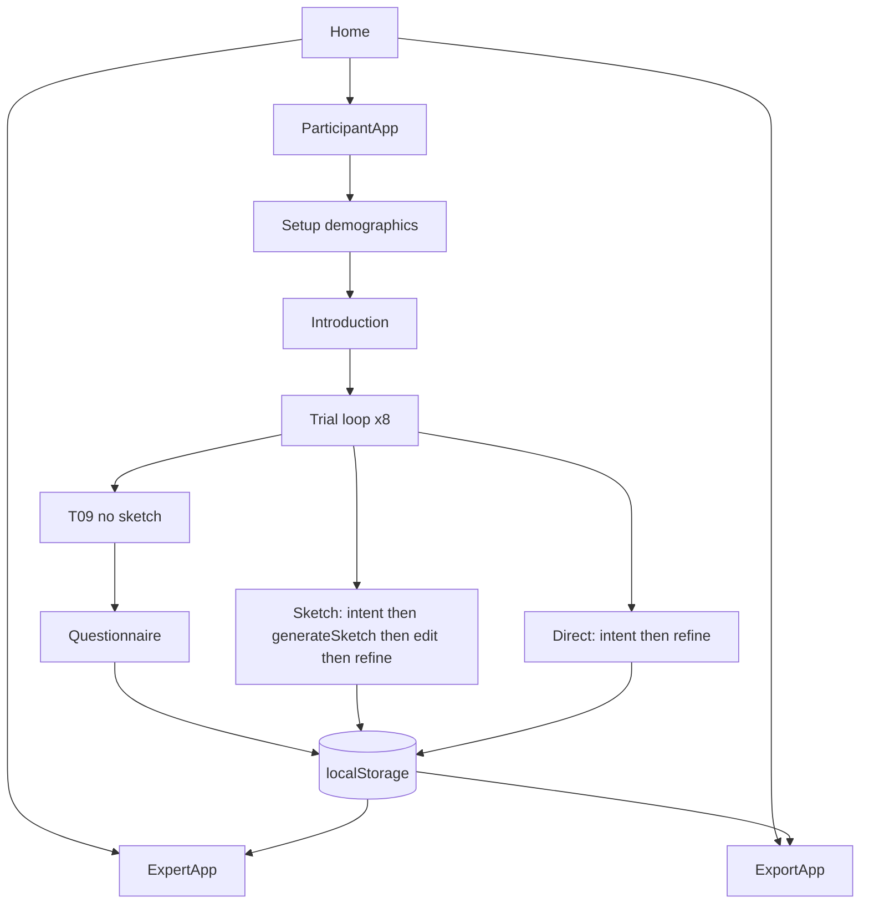

# CHItest 用户使用指南与系统框架

CHItest 是 CHI 2027 影视镜头表达实验系统。它**不生成最终成片图**，只生成可编辑的低保真草图（Sketch Scaffold）。

```text
Vague Intent → Low-fi Sketch → Human editing → Refined Intent → 4-expert blind rating
```

---

## 1. 启动

```bash
cd CHItest
npm install
npm run dev
```

浏览器打开终端打印的地址，默认：

```text
http://localhost:5173
```

| 地址 | 角色 |
| --- | --- |
| `#/` | 首页 |
| `#/participant` | 被试：T1 baseline → T2 Direct/Sketch → T3 transfer |
| `#/participant?short=1` | 干跑（1 Direct + 1 Sketch + Transfer） |
| `#/expert` | 四专家盲评（1–7，与 G1 文本编码分开） |
| `#/coding` | 研究者 G1 六维编码（0–18）+ G2 + G3 |
| `#/export` | participant / intent / sketch_interactions / expert_ratings CSV |

数据存在**当前浏览器**的 `localStorage`，换电脑或清站点数据会丢。正式实验请当场从 Export 下载。

---

## 2. 三类使用者

### 2.1 实验员（主试）

1. 打开首页，确认本机浏览器干净（或同一台实验机）。
2. 点 **Participant**，帮被试填：
   - Participant ID（如 `P001`，不可复用已完成 ID）
   - Counterbalance group（四选一，或用系统轮转默认值）
   - 背景变量：影视经验、视觉经验、AI familiarity
3. 被试全程自己点 **Continue**。不要提示 OTS、俯拍、过肩等术语。
4. 结束后点 **Export**，下载 JSON / CSV，拷到 `CHItest/exports/` 或实验室网盘。
5. 下一名被试前，如需空库，Export 页点 **Clear local data**（会清掉本浏览器全部 CHItest 数据）。

组别含义见 [experiment-protocol.md](experiment-protocol.md)。

### 2.2 被试（Participant）

系统会读任务 brief。没有标准答案，用日常语言描述即可。

**Direct / Sketch 每题都是 T1 → T2**

```text
T1 Baseline（无 AI、无 Sketch）→ T2 Direct 重写  或  T2 Sketch 改草图后再写
```

最后 **T3 Transfer**：全新题目，完全去掉 AI 和 Sketch。

草图里可以：

- 移动人物 / 物体 / 机位
- 旋转人物或 Camera（±15°）
- 添加人物、物体、视线（gaze）、运动箭头
- 删除选中元素（Camera 不能删）

不要追求画面好看。草图只表示位置、朝向、视线、前后景。

**Transfer（最后一题）**

没有草图、没有 AI。只写一次镜头描述。

最后有 4 道 1–7 问卷（控制感、有用性、认知负荷、信心），填完即结束。

中途刷新：未完成 session 会按 Participant ID 恢复。不要换浏览器。

### 2.3 专家（Blind rater）

1. 打开 **Expert evaluation**。
2. 选自己的身份（登录页可见真名；评卷页只显示 Expert 01–04）。
3. 每条材料只有：Task、Initial Intent、Final Intent、Final Sketch（没有草图时写 `Sketch not collected for this trial`）。
4. **看不到**：condition、点击日志、被试背景、Participant ID。
5. 对 Initial 和 Final **分别**打 1–7：
   - Intent Precision
   - Interpretability
   - Spatial / Relational Specificity
   - Executability
6. Naturalness 为辅助项，可空。Comment 可选。
7. 四位专家必须各评各的；系统不存平均分。

专家身份映射：

| expert_id | 登录显示 |
| --- | --- |
| expert_01 | 辛向阳 |
| expert_02 | 娄永琪 |
| expert_03 | 李何槿 |
| expert_04 | 柳喆俊 |

---

## 3. 系统组成框架

```text
CHItest/
├── config/experiment.json      # 条件、组别、专家、sketch_mode
├── data/tasks/tasks.json       # T01–T08 + T09 Transfer
├── app/
│   ├── App.tsx                 # 首页 / 被试 / 专家 / 导出 路由
│   ├── participant/            # 被试状态机
│   ├── expert/                 # 盲评
│   ├── export/                 # JSON/CSV
│   └── shared/
│       ├── store.ts            # localStorage
│       ├── schedule.ts         # 平衡设计
│       ├── export.ts
│       └── sketch/             # 草图引擎（生图入口在这里）
└── docs/
```



运行时没有后端。浏览器里完成实验、记日志、导出文件。

| 层 | 职责 | 主要文件 |
| --- | --- | --- |
| 实验配置 | 任务、组别、专家、草图模式 | `config/experiment.json`, `data/tasks/tasks.json` |
| 被试流程 | 步骤、禁止返回已提交页 | `app/participant/ParticipantApp.tsx` |
| 草图引擎 | 模板 SVG、操作、序列化 | `app/shared/sketch/*` |
| 存储 | session / trial / ratings | `app/shared/store.ts` |
| 盲评 | 双组 Likert | `app/expert/ExpertApp.tsx` |
| 导出 | JSON + CSV | `app/shared/export.ts` |

---

## 4. 生图 API 放在哪里

**正式实验默认不接视觉模型。**  
`config/experiment.json` 里 `sketch_mode` 现在是 `"mock"`：按任务模板生成可控 SVG（Camera 三角、人物火柴人、物体矩形）。

以后若要接模型，只改下面这一条链路，不要接到被试文本框，也不要生成高清成片。

### 4.1 开关

[`config/experiment.json`](../config/experiment.json)

```json
"sketch_mode": "mock",
"sketch_model": {
  "name": "mock-svg",
  "version": "1.0.0"
}
```

改成 `"sketch_mode": "model"` 后，生成记录会带上内部 prompt；**被试看不到这段 prompt**。

### 4.2 唯一调用点（接 API 的地方）

[`app/shared/sketch/generate.ts`](../app/shared/sketch/generate.ts) 的 `generateSketch(taskId, intent)`。

被试提交 Initial Intent 且本题是 Sketch 条件时，由 [`app/participant/ParticipantApp.tsx`](../app/participant/ParticipantApp.tsx) 调用。

当前实现：即使 `sketch_mode === "model"` 也回退 mock。接 API 时在这个 `if` 里发请求：

```ts
export function generateSketch(taskId: string, intent: string): SketchRecord {
  if (experiment.sketch_mode === 'model') {
    // 在这里调用视觉 API，失败则回退 mock
  }
  return makeSketchRecord(generateMockScene(taskId, intent))
}
```

### 4.3 内部生图 Prompt（用户不可见）

写在 [`app/shared/config.ts`](../app/shared/config.ts) 的 `SKETCH_MODEL_PROMPT`。要求：黑白线稿分镜缩略图，只表示机位/人物/物体/空间/视线/运动，禁止写实人脸、服装、光影、成片质感。

### 4.4 Mock 模板（无 API 时的稳定草图）

| 文件 | 作用 |
| --- | --- |
| `app/shared/sketch/templates.ts` | 每道 task 的初始布局 |
| `app/shared/sketch/heuristics.ts` | 从 intent 做极弱微调（人数、window、behind） |
| `app/shared/sketch/render.ts` | 场景图 → SVG 字符串 |
| `app/shared/sketch/actions.ts` | 编辑操作 reducer |
| `app/shared/sketch/SceneEditor.tsx` | 被试可操作画布 |

建议接入方式：模型输出仍解析/映射回 `SketchScene`（camera / subjects / objects / gazes / movements），这样编辑器和日志不用改。不要把 PNG 成片直接丢进中间栏当 Scaffold。

### 4.5 不要放 API 的地方

- 被试 Refine 文本框：禁止自动改写成专业 Prompt
- 专家页：禁止再生成图
- StoryLens 的即梦 / LoRA / 知识图谱代理：CHItest 刻意不复用，以免论文变量混杂

每条 sketch 记录字段：`model`, `model_version`, `generation_prompt`, `generation_timestamp`, `output.scene`, `output.svg`。
